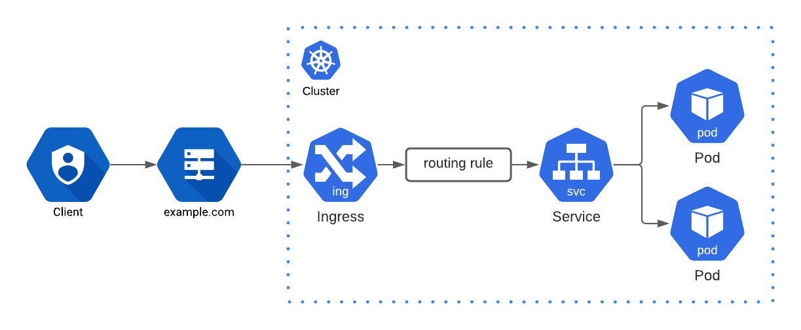

In the Docker Swarm, if you want to give your application external access, you need to expose it via port (see the [`swarm-repetition` scenario](https://www.katacoda.com/qwinkler/scenarios/swarm-repetition) if you don't understand).

In a Kubernetes we have [Ingress Object](https://kubernetes.io/docs/concepts/services-networking/ingress). An API object that manages external access to the services in a cluster, typically HTTP. Ingress may provide load balancing, SSL termination and name-based virtual hosting.

> I would definetly recommend you to read the official documentation for better explanation of that.

You already what the Service and Pod is, and how they relate. Here is the diagram of Ingress and how it works:

So, it is just an entrypoint to your cluster.